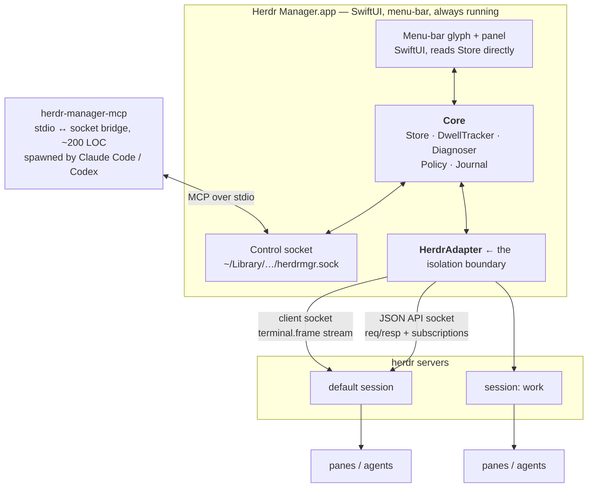
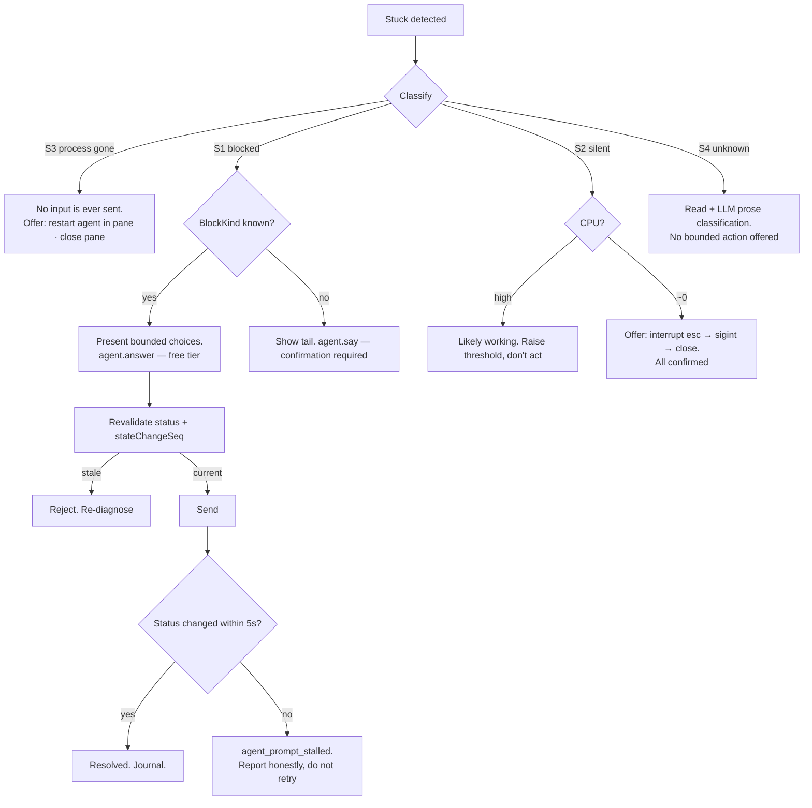

# Herdr Manager — design and build plan

Target: herdr `v0.7.5`, source HEAD `e16d7d8c07a20f5ee0b4111808680bbcfd7df9ac` (2026-07-28), wire protocol version **17** (integer `uint32` in the schema). Compatibility is **capability-based**, not version-string-assumed (§0.2, §3.2).

## 0. Verification status, and the version problem

Claims are labelled `[verified-source]` (I read the implementing code at HEAD), `[verified-docs]` (v0.7.5 reference docs, consistent with source), `[verified-live]` (confirmed from real output on your Mac), or `[assumed]`.

### 0.1 Your actual environment `[verified-live]`

```
herdr 0.7.5 · client protocol 17 · server protocol 17 · compatible: yes
socket: /Users/admin/.config/herdr/herdr.sock
sessions: 1 — "default" only, session_dir /Users/admin/.config/herdr
api schema: 235,560 bytes
agents: 34 across 8 workspaces (w5, w7, wA, wB, wC, wD, wE)
  by kind:   codex 13 · claude 9 · opencode 9 (+3 shell panes)
  by status: idle 32 · working 2 · blocked 0 · done 0
```

Everything structural in this plan is confirmed by that output: session-qualified opaque IDs, `agent_status` vocabulary, `agent_session` native references, `foreground_cwd`, `terminal_title_stripped`, `revision`, `screen_detection_skipped`, socket location and `0600` mode. Protocol 17 is an integer (`uint32`) on the wire; compatibility is capability-based, not assumed from a version string (§0.2, §3.2).

### 0.2 Resolved: protocol 17, capability-based compatibility

The original gap (0.7.4 / protocol 16 vs. the 0.7.5 this plan was written against) is **resolved**: the live environment now runs herdr 0.7.5 at protocol **17** (an integer `uint32` on the wire). All of the write-path primitives this plan depends on — `agent.prompt` (atomic, bracketed-paste aware), `agent_prompt_stalled`, `agent.wait` with occupant pinning, `agent.start`, machine-readable `protocol_mismatch` — are present and verified.

**Compatibility is capability-based, not version-string-assumed.** The adapter does not hard-reject on `protocol != 17`. Instead, `HerdrAdapter.health()` returns an `AdapterHealth` value:

```swift
struct AdapterHealth {
  let protocolVersion: Int       // wire protocol observed at connect
  let compatible: Bool           // true when the observed protocol is one the adapter was built against
  let writesEnabled: Bool        // true only for the verified protocol (currently 17)
  let reason: String?            // human-readable explanation when writes are disabled
}
```

- `compatible == true` and `writesEnabled == true` for protocol 17 — the verified baseline.
- Unknown or newer protocols: `compatible` may still be `true` (reads parse), but `writesEnabled` is `false` with a `reason` explaining which capability is unverified. READ tools continue to work; WRITE tools are disabled with a visible reason in the UI and MCP.
- Older protocols: `compatible == false`, both reads and writes degrade per the failure-mode table (§8.3).

`HerdrSnapshot.protocol` is an `Int` (not a string), matching the wire type. This model means a herdr upgrade to protocol 18 does not silently break writes — it disables them with an explanation until the adapter is verified against the new protocol.

---

## 1. Findings

### 1.1 The good news: scrollback is not the constraint

You predicted pane output might be unavailable and called it the biggest risk. It isn't. `pane.read` is a first-class method with four snapshot sources.

`[verified-source]` `src/api/schema/panes.rs:252-262`:

```rust
pub struct PaneReadParams {
    pub pane_id: String,
    pub source: ReadSource,
    pub lines: Option<u32>,
    pub format: ReadFormat,        // Text | Ansi
    pub strip_ansi: bool,          // default true
}
```

`[verified-source]` `src/api/schema/common.rs:62-67`:

```rust
pub enum ReadSource { Visible, Recent, RecentUnwrapped, Detection }
```

Returns `PaneReadResult { pane_id, workspace_id, tab_id, source, format, text, revision, truncated }` (`panes.rs:623-632`). `agent.read` is the same over an agent target.

| Source | Meaning `[verified-docs]` |
|---|---|
| `visible` | Current rendered screen |
| `recent` | Recent scrollback, terminal wrapping preserved |
| `recent_unwrapped` | Recent scrollback, soft wraps removed — best for logs |
| `detection` | The exact bottom-buffer snapshot herdr's own state detection runs on |

`detection` is the one that matters most: reading it means the Manager and herdr are reasoning over identical bytes, so the Manager can never disagree with the sidebar for want of different input.

Critically, `[verified-docs]` **CLI/API reads do not mark a tab "seen"**, so polling does not consume the `done` state. Only focusing does.

### 1.2 herdr already computes *why* an agent is blocked

This is the single most valuable discovery, and it collapses most of the "stuck diagnosis" work.

State detection is a declarative rule engine over per-agent TOML manifests — 19 shipped (`src/detect/manifests/`). `[verified-source]` from `claude.toml`:

```toml
[[rules]]
id = "bash_permission_prompt"
state = "blocked"
priority = 980
region = "after_last_horizontal_rule"
visible_blocker = true
contains = ["enter to select", "esc to cancel"]
```

Claude Code's `blocked` rules are `live_blocked_form`, `dynamic_workflow_prompt`, `bash_permission_prompt`, `generic_permission_prompt`, `legacy_no_prompt_blocker`. Codex's are `osc_title_blocked`, `live_strong_blocker`, `weak_blocker`.

`agent.explain` exposes the evaluation `[verified-source]` `src/detect/manifest.rs:28-47`:

```rust
pub struct DetectionExplain {
    pub agent: Option<String>,
    pub state: AgentState,
    pub source: Option<ManifestSource>,
    pub matched_rule: Option<MatchedRule>,
    pub screen_detection_skipped: bool,
    pub visible_idle: bool, pub visible_blocker: bool, pub visible_working: bool,
    pub skip_state_update: bool,
    pub skipped_update_reason: Option<String>,
    pub fallback_reason: Option<String>,
    pub evaluated_rules: Vec<EvaluatedRule>,
    pub warning: Option<String>,
    pub manifest_version: Option<String>,
    // ...
}
```

So "what is this session waiting on" starts with a free, exact answer: the matched rule ID names the *kind* of block. The Manager does not have to re-derive this from raw text.

**Caveat, and it's a real one.** At the API boundary the explain payload is untyped `[verified-source]` `src/api/schema/response.rs:169-171`:

```rust
AgentExplain { explain: serde_json::Value },
```

It is not covered by the JSON Schema. Its shape can change without any schema-level signal. Treat it as advisory (§8.3).

### 1.3 The actual constraint: there is no output-change signal

This is the finding that shapes the architecture, and it is the opposite of what you expected.

**You cannot subscribe to "this pane produced output."**

`Subscription` — the complete set of things `events.subscribe` accepts `[verified-source]` `src/api/schema/events.rs:18-84` — contains 28 variants. Pane-related ones are `pane.created`, `pane.closed`, `pane.updated`, `pane.focused`, `pane.moved`, `pane.exited`, `pane.agent_detected`, `pane.output_matched`, `pane.agent_status_changed`, `pane.scroll_changed`. There is **no** `pane.output_changed` variant. Confirmed against the match arms in `src/api/subscriptions.rs:150-296`. Subscription records arrive wrapped as `{"event": "<kind>", "data": { ... }}` — not a flat `{type, pane_id, ...}` record. The only status subscription the Manager uses is `pane.agent_status_changed`; pane lifecycle (created/closed/moved) is reconciled via periodic snapshots, not subscriptions. Unknown event kinds map to `.ignored` (never a disconnect).

`EventKind::PaneOutputChanged` / `"pane.output_changed"` *is* declared (`events.rs:216,247,279,521`) — but it is **never emitted in production**. The only two constructions anywhere under `src/app/` are inside `#[cfg(test)]`, one of them a test literally named `output_changed_event_hooks_do_not_run_even_if_event_is_emitted` (`src/app/api/plugins/mod.rs:3115-3133`). It is declared-but-dead surface. `[verified-source]`

Three consequences, each of which cost me a candidate design:

**`pane.output_matched` cannot be repurposed as an output stream.** It is edge-triggered by a latch `[verified-source]` `src/api/subscriptions.rs:357-373`:

```rust
Some(matched_line) => {
    if self.currently_matching { return None; }   // latched
    self.currently_matching = true;
    ...
}
```

A catch-all regex fires exactly once, ever, then latches.

**`PaneInfo.revision` is not an output counter.** The only mutation site is inside `set_terminal_title` and only when the *stripped* title changes `[verified-source]` `src/terminal/state.rs:190-198`. Using it as an output heartbeat would silently never fire for agents that don't rewrite their title.

**herdr itself polls.** `pane.wait_for_output` is a server-side read-and-compare loop at `CONNECTION_POLL_INTERVAL = 100ms` `[verified-source]` `src/api/server.rs:29`, `src/api/wait.rs:80-128`.

### 1.4 But there *is* a real-time output stream — on the other socket

`herdr terminal session observe <target>` opens a read-only live terminal stream. `[verified-source]` `src/client/mod.rs:962-976`:

```rust
Ok(ServerMessage::Terminal(frame)) => {
    let encoded = base64::…encode(&frame.bytes);
    let line = serde_json::json!({
        "type": "terminal.frame", "seq": frame.seq, "encoding": "ansi",
        "width": frame.width, "height": frame.height,
        "full": frame.full, "bytes": encoded,
    });
```

`[verified-docs]` "Multiple observers can watch the same terminal without taking input, resize, scroll, or takeover authority." Terminated by a `terminal.closed` record.

This lives on the **client protocol socket** (`herdr-client.sock`), not the JSON API socket. That is a separate transport with separate framing, and it is the lower-level, less-stable of the two.

The design consequence, and it's the nice one: **the Manager does not need to parse these frames.** Frame arrival alone is the signal. `bytes.len() > 0` at wall-clock `T` means "this pane emitted output at T." No VT parsing, no terminal emulation. Content questions are answered separately by `pane.read` on the stable API socket.

### 1.5 herdr timestamps nothing

There is no wall-clock time anywhere in the agent or pane records, and none on events.

`AgentInfo` `[verified-source]` `src/api/schema/agents.rs:184-223` carries `state_change_seq: u64` — a monotonic counter, not a time. The status event carries only `{ pane_id, agent_status }` (`events.rs:186-189`). The only `*_unix_ms` fields in the whole API schema are on plugin install records and agent-manifest update checks. `[verified-source]` (grep across `src/api/schema/*.rs`)

**Therefore: every duration in this product is Manager-owned.** "Blocked for 4 minutes" is a fact the Manager computes by stamping events on arrival. herdr cannot tell you how long anything has been in a state. This is the reason a persistent daemon exists at all (§3).

### 1.6 Control surface

| Capability | Method | Notes |
|---|---|---|
| Send literal text | `pane.send_text` | No submit |
| Send keys | `pane.send_keys` | Validated key-combo strings; all keys validated before any bytes are written `[verified-docs]` |
| Text + keys | `pane.send_input` | |
| Prompt an agent | `agent.prompt` | Bracketed-paste aware, submits text + Enter **atomically**, works even while agent is working. Optional `wait: {until, timeout_ms}` in the same request to avoid a send/wait race `[verified-docs]` |
| Keys to an agent | `agent.send_keys` | `enter`, `esc`, `ctrl+c`, `up`… |
| Wait for state | `agent.wait` | Server-owned, event-driven; **pins the resolved pane occupant** so a replacement process cannot satisfy the wait `[verified-docs]` |
| Start an agent | `agent.start` | `{name, kind, pane_id, args, timeout_ms}`. Requires an *existing idle shell pane*; never creates layout. 21 kinds. Returns only once the agent is detected and interactive-ready |
| Close a pane | `pane.close` | |
| Process introspection | `pane.process_info` | `shell_pid`, `foreground_process_group_id`, `tty`, `foreground_processes[{pid,name,argv0,cwd}]` `[verified-source]` `panes.rs:438-455` |
| Bootstrap cache | `session.snapshot` | Full state in one call; docs explicitly prescribe snapshot-then-subscribe `[verified-docs]` |
| Notify | `notification.show` | Reuses herdr's own toast delivery |
| Annotate herdr's UI | `pane.report_metadata` | Display-only `tokens`, renderable as `$name` in herdr's sidebar. Cannot override semantic state |

`agent.prompt --wait` returns `agent_prompt_stalled` if a prompt from a non-working state produces no lifecycle change within 5s `[verified-docs]`. That is a free "my input did nothing" signal — used in §7.4.

### 1.7 Status vocabulary

`[verified-source]` `src/api/schema/common.rs:144-150`: `Idle | Working | Blocked | Done | Unknown`.

`[verified-docs]` semantics, which matter more than the names:
- `idle` — ready for input, **and** its tab has been seen in the focused herdr UI.
- `done` — the same underlying idle state, for work that finished while unseen.
- `blocked` — herdr recognised an approval or question UI.
- `unknown` — an agent is present but herdr cannot classify it. **Explicitly not a success signal.**

`done` is consumed by focusing the tab, or by targeting it with `pane.focus` / `agent.focus`. Reads do not consume it. **The Manager must therefore never auto-focus** — doing so would silently clear the "finished while you weren't looking" signal that makes the roll-up useful.

### 1.8 Transport and sessions

`[verified-source]` `src/session.rs:161-185`, `src/api/server.rs:28`:

```
~/.config/herdr/herdr.sock                     JSON API,  default session
~/.config/herdr/herdr-client.sock              client protocol, default session
~/.config/herdr/sessions/<name>/herdr.sock            named session
~/.config/herdr/sessions/<name>/herdr-client.sock
```

The `~/.config/herdr` root is **not hardcoded**: `config_dir()` returns `$XDG_CONFIG_HOME/herdr` when that variable is set, falling back to the platform default `[verified-source]` `src/config/io.rs:29-34`. Session discovery must read the env var rather than assuming the literal path, or the Manager will silently find zero sessions on a machine where you've set XDG. `HERDR_SOCKET_PATH` and `HERDR_SESSION` override further (resolution order in §1.8's source, `src/session.rs:173-181`).

Unix domain sockets, mode `0600` `[verified-live]`. Newline-delimited JSON, one request per line, responses echo the request `id`. Subscriptions keep the connection open and push subsequent lines. Protocol version is **17** (integer `uint32`) on the live 0.7.5 install `[verified-live]`; mismatches are rejected with an explicit older/newer message (`wire.rs:945-953`), machine-readable from 0.7.5 (§0.2). Socket resolution order: `HERDR_SOCKET_PATH` → `HERDR_SESSION` (named-session lookup) → `XDG_CONFIG_HOME/herdr` → platform default (`~/.config/herdr/herdr.sock`).

**Your session reality** `[verified-live]`: one session, `"default"`, at `~/.config/herdr/herdr.sock`. You answered "named sessions" when I asked, but `herdr session list` shows none — so multi-session is a plan for how you intend to work, not how you work today. This plan keeps session-qualified IDs everywhere (they cost nothing and prevent R9) but defers the actual connection pool: Phase 0 opens one connection and enumerates sessions, which is correct for one session and correct for five.

`herdr api schema --json` emits the full JSON Schema **from the installed binary**. This is the drift-detection anchor (§8.3).

---

## 2. Capability matrix

| # | Capability you asked for | Mechanism | Confidence | Fallback if it breaks |
|---|---|---|---|---|
| 1 | Enumerate spaces/tabs/panes/agents | `session.snapshot`, then `workspace.list` / `pane.list` / `agent.list` | `[verified-source]` High | `herdr api snapshot` via CLI subprocess |
| 2 | Live status without polling | `events.subscribe` → `pane.agent_status_changed` (+ lifecycle events) | `[verified-source]` High | Poll `agent.list` at 2s; ~2 KB/call |
| 3 | Read pane output / scrollback | `pane.read`, 4 sources | `[verified-source]` High | `herdr pane read` subprocess |
| 4 | Know *why* an agent is blocked | `agent.explain` → `matched_rule.id` | `[verified-source]` **Medium — untyped payload** | Classify the `detection` read text against a local copy of the manifest regexes (vendored from `src/detect/manifests/`) |
| 5 | Detect "working but silent" | `terminal session observe` frame arrival timestamps | `[verified-source]` Medium — client socket, subprocess-per-pane | Poll `pane.read --source detection`, hash, compare. ~1 call/pane/10s |
| 6 | How long has it been stuck | **Not available from herdr.** Manager stamps events on arrival | `[verified-source]` (absence) High | None. Owned by us permanently |
| 7 | Detect crashed process, live pane | `pane.process_info` + `pane.exited` event | `[verified-source]` High | `ps` against `shell_pid` locally |
| 8 | Answer a blocked prompt | `agent.send_keys` (bounded keys) / `agent.prompt` | `[verified-source]` High | `pane.send_keys` |
| 9 | Free-text instruction to an agent | `agent.prompt` (atomic, bracketed-paste aware) | `[verified-source]` High | `pane.send_text` + `pane.send_keys enter` — **non-atomic, avoid** |
| 10 | Spawn a session in repo Y | `workspace.create` → `pane.split` → `agent.start` | `[verified-source]` High | `herdr` CLI subprocess chain |
| 11 | Kill idle sessions | `pane.close` | `[verified-source]` High | — |
| 12 | Interrupt a runaway agent | `agent.send_keys ["esc"]` or `["ctrl+c"]` | `[verified-source]` High | — |
| 13 | Detect API drift | `ping` (protocol 17) + hash of `herdr api schema --json` | `[verified-source]` High | Version-gate on `herdr --version` |
| 14 | Multiple named sessions | One socket pair per session under `sessions/<name>/` | `[verified-source]` High | — |
| 15 | Notify natively | `UNUserNotificationCenter`; optionally mirror via `notification.show` | `[assumed]` (AppKit) High | herdr's own toast only |
| 16 | Write status back into herdr's sidebar | `pane.report_metadata` tokens → `$name` | `[verified-docs]` Medium | Skip; Manager UI only |

**Nothing you asked for is unavailable.** The two soft spots are #4 (untyped) and #5 (no first-class mechanism — costs a subprocess or a poll loop). Neither requires patching herdr. Patching herdr is not proposed anywhere in this plan; it would fork you off an AGPL project that ships releases weekly, for two problems that both have adequate workarounds.

---

## 3. Architecture

### 3.1 Process model

Two processes, one of which is ephemeral and trivial.



**Why the menu-bar app owns the Core, rather than a separate daemon.** Dwell time (§1.5) must be tracked continuously or it is worthless, so *something* must always run. A menu-bar app already always runs. Adding a third process to hold state you already have a home for is the kind of thing that doesn't earn its place. Cost: quitting the app resets dwell history — mitigated by journalling state transitions to disk on write, so a restart recovers durations rather than zeroing them.

**Why the MCP server is a separate process and must be.** MCP servers are spawned and killed by the agent host, on its schedule, possibly several at once. It cannot own state or hold subscriptions. It is a bridge: stdio JSON-RPC in, Manager control socket out. It contains no herdr knowledge whatsoever — if you swap SwiftUI for something else later, the bridge is unaffected.

### 3.2 The adapter boundary

Everything that knows herdr exists lives in `HerdrAdapter`. Nothing above it references a herdr method name, socket path, or JSON shape.

```
┌─ Core, UI, MCP ────────── domain types only: Herd, Agent, Verdict, Action
├─ HerdrAdapter ────────── translation + version gate + degradation  ← ALL herdr knowledge
│    ├─ HerdrApiClient      NDJSON on herdr.sock: request/response + subscriptions
│    ├─ HerdrObserver       frame-arrival stream on herdr-client.sock (subprocess)
│    └─ HerdrSchemaGate     protocol/schema check at connect
└─ herdr server
```

Adapter interface (Swift, illustrative):

```swift
protocol HerdrAdapter {
  // reads
  func snapshot(session: SessionRef) async throws -> HerdSnapshot
  func read(_ a: AgentRef, source: ReadSource, lines: Int) async throws -> PaneText
  func explain(_ a: AgentRef) async throws -> BlockClassification   // never throws on shape drift
  func processInfo(_ a: AgentRef) async throws -> ProcessFacts

  // streams
  func statusEvents(session: SessionRef) -> AsyncThrowingStream<StatusChange, Error>
  func lifecycleEvents(session: SessionRef) -> AsyncThrowingStream<TopologyChange, Error>
  func outputHeartbeat(_ a: AgentRef) -> AsyncThrowingStream<Date, Error>   // frame arrival only

  // writes — all go through Policy first; none are callable from UI/MCP directly
  func sendKeys(_ a: AgentRef, _ keys: [KeyCombo]) async throws
  func prompt(_ a: AgentRef, _ text: String, wait: WaitSpec?) async throws -> PromptOutcome
  func startAgent(kind: AgentKind, in: PaneRef, name: String, args: [String]) async throws -> AgentRef
  func closePane(_ p: PaneRef) async throws
  func focus(_ a: AgentRef) async throws          // consumes `done` — explicit user action only

  func health() async -> AdapterHealth            // capability-based, not version-string-assumed
}
```

`AdapterHealth` (§0.2) carries `protocolVersion: Int`, `compatible: Bool`, `writesEnabled: Bool`, `reason: String?`. Writes are gated behind `health().writesEnabled` — `true` only for the verified protocol (currently 17). Unknown or incompatible protocols keep READ tools working but disable WRITE tools with a visible reason. `HerdrSnapshot.protocol` is an `Int`, matching the wire type.

`explain` deliberately does not surface herdr's raw shape. It returns a Manager-owned `BlockClassification` and returns `.unclassified` on any parse failure. One untyped field cannot break the app.

**Subscription envelope.** Status and lifecycle events arrive as `{"event": "<kind>", "data": { ... }}`, not a flat `{type, pane_id, ...}` record. The only schema-supported status subscription used is `pane.agent_status_changed`; pane lifecycle (created/closed/moved) comes via periodic snapshot reconciliation, not subscriptions. Unknown event kinds are mapped to an `.ignored` no-op — they must NOT cause a disconnect. Periodic `session.snapshot` calls remain the safety net that reconciles any events the subscription layer missed or intentionally ignored.

**`workspace.create` response shape.** The real response is `{"type":"workspace_created","workspace":{...,"workspace_id":...},"tab":{"tab_id":...},"root_pane":{"pane_id":...}}`. The adapter returns `WorkspaceCreation { workspaceId, rootPaneId, tabId? }`. `session.spawn` MUST use the returned `rootPaneId` for the subsequent `agent.start` — never synthesize a pane id like `"p1"`.

### 3.3 Data flow

**Steady state.** Connect → `session.snapshot` per session → build Store → `events.subscribe` for `pane.agent_status_changed` (the only status subscription) → apply deltas wrapped in `{"event":..., "data":...}` envelopes. Unknown event kinds map to `.ignored` (no disconnect). Topology (pane created/closed/moved) is reconciled via periodic `session.snapshot` calls, not subscriptions. Zero polling for status; topology polling is the safety net.

**Dwell.** Every applied status change stamps `enteredAt = now()` on the agent and appends to the journal. All durations derive from this.

**Output heartbeat.** For agents in `working` only, the Observer subprocess pool holds a `terminal session observe` stream; each frame updates `lastOutputAt`. Bounded pool (default 12, LRU by `enteredAt`). Agents not in `working` need no heartbeat — nothing is expected to be moving.

**Diagnosis.** Lazy. Runs on demand (panel row expanded, MCP `agent.diagnose`) or when a stuck predicate fires. Never on a timer across the whole herd.

---

## 4. State model

### 4.1 Entities and mapping

| Manager entity | herdr concept | Identity | Sync |
|---|---|---|---|
| `Session` | named session / default | `name` (`"default"` sentinel) | Enumerated from `~/.config/herdr/sessions/` + default; one connection each |
| `Space` | workspace | `SpaceID(session, "w1")` | `workspace.*` events |
| `Tab` | tab | `TabID(session, "w1:t1")` | `tab.*` events |
| `Pane` | pane | `PaneID(session, "w1:p1")` | `pane.created/closed/moved/exited` |
| `Agent` | detected agent occupying a pane | `AgentID(session, paneID)` | `pane.agent_detected`, `pane.agent_status_changed` |
| `Status` | `agent_status` | enum | push events |
| `Dwell` | **none — Manager-owned** | — | stamped locally |
| `Verdict` | **none — Manager-owned** | — | computed on demand |

Every ID is session-qualified. herdr's `w1:p1` is only unique within a session; you run named sessions, so an unqualified pane ID is a latent collision bug. Qualify at the adapter, always.

```swift
struct Agent: Identifiable {
  let id: AgentID                      // (session, paneID)
  var kind: String?                    // "claude", "codex", …
  var name: String?                    // agent.start name, if any
  var displayName: String?             // display_agent / label / terminal_title_stripped
  var space: SpaceID; var tab: TabID
  var cwd: URL?; var foregroundCwd: URL?

  var status: AgentStatus              // from herdr
  var stateChangeSeq: UInt64           // herdr's counter — ordering guard
  var enteredAt: Date                  // MANAGER-OWNED
  var lastOutputAt: Date?              // MANAGER-OWNED, working panes only
  var screenDetectionSkipped: Bool
  var interactiveReady: Bool

  var verdict: Verdict?                // cached diagnosis, invalidated on any change
}

enum Verdict {
  case healthy
  case awaitingInput(BlockClassification, since: Date)
  case silent(since: Date, cpu: CPUState?)
  case processGone(lastLine: String?)
  case unclassifiable(reason: String)
}
```

### 4.2 Keeping sync honest

- **Ordering.** Apply a status change only if `stateChangeSeq` is greater than the stored value. Guards against reordering across reconnects.
- **Reconnect.** On any disconnect: mark session `.stale`, grey it in the UI, retry with backoff 1s→30s. On reconnect: fresh `session.snapshot`, diff, adopt. **Suppress notifications for the diff** — otherwise a server restart fires an alarm for every agent at once. Dwell for agents whose status changed while disconnected is stamped `reconnectedAt` and displayed as `≥ Xm`, never a fabricated exact figure.
- **Pane moves.** `pane.moved` across workspaces assigns a *new* pane ID `[verified-docs]`. Subscribe to it and re-key rather than treating it as close+create; herdr explicitly does not emit fake close/create for moves.
- **No ID reuse.** Closed tab and pane IDs are never reused `[verified-docs]`, so the journal can key on them safely.

---

## 5. MCP tool surface

Design rules: small, sharply named, bounded. Every tool has a narrow return shape. **No free-form shell passthrough, no raw `pane.send_keys`, no generic `herdr_call(method, params)`.** Reasoning in §8.1.

Naming is `herd.*` for fleet-level, `agent.*` for one target.

### 5.1 Read tier — freely agent-invokable

**`herd.overview`** — the "what's happening" call.
```
params: { session?: string }
returns: {
  sessions: [{ name, connected: bool, protocol: int }],
  counts: { blocked: int, working: int, silent: int, done: int, idle: int, unknown: int },
  attention: [{ agentId, name, kind, space, status, waitingOn?: string, forSeconds: int }],
  degraded?: string
}
```
`attention` is pre-sorted: `processGone` → `awaitingInput` → `silent` → `done`. Capped at 20.

**`agent.list`**
```
params: { session?, space?, status?: [Status], stuckOnly?: bool }
returns: { agents: [{ agentId, name, kind, space, tab, cwd, status, forSeconds, lastOutputSeconds? }] }
```

**`agent.inspect`**
```
params: { agentId: string }
returns: { agentId, name, kind, space, tab, cwd, foregroundCwd, status, forSeconds,
           lastOutputSeconds?, interactiveReady, verdict: { type, detail },
           process?: { foreground: [{ pid, name, cwd }], cpuState? } }
```

**`agent.tail`** — bounded output read.
```
params: { agentId, lines?: int (default 40, max 200),
          source?: "visible"|"recent"|"recent_unwrapped"|"detection" (default "detection") }
returns: { text: string, truncated: bool, redactions: int }
```
Default `detection` — smallest useful window, identical to what herdr classified. Secret-scrubbed (§8.2).

**`agent.diagnose`** — the product. One call, complete answer.
```
params: { agentId }
returns: {
  verdict: "awaiting_input" | "silent" | "process_gone" | "unclassifiable" | "healthy",
  confidence: "high" | "medium" | "low",
  summary: string,                    // one line, human-first
  waitingOn?: { kind: BlockKind, prompt: string, choices?: [string] },
  forSeconds: int, lastOutputSeconds?: int,
  evidence: { matchedRule?: string, manifestVersion?: string,
              tailLines: [string], process?: {...} },
  suggested: [{ tool: string, params: object, requiresConfirmation: bool }]
}
```
`suggested` is the hinge between diagnosis and action: the agent gets a ready-to-invoke call, and the `requiresConfirmation` flag is honest about what will happen.

### 5.2 Write tier — policy-gated

**`agent.answer`** — reply to a *blocked* agent. **Bounded choices only; no free text.**
```
params: { agentId, choice: "approve" | "deny" | "accept_once" | "select" | "cancel",
          index?: int }              // index only meaningful with "select"
returns: { sent: bool, resolvedKeys: [string], newStatus?: Status, actionId: string }
```
Preconditions, all enforced server-side in the Manager:
- current status **must** be `blocked`, revalidated immediately before send
- `stateChangeSeq` must match the value from the `diagnose`/`inspect` the agent acted on — a stale answer is rejected, not sent
- at most 3 consecutive answers to one agent without an intervening status change

**`agent.say`** — free-text prompt via `agent.prompt`.
```
params: { agentId, text: string (max 2000), waitFor?: "idle"|"done"|"blocked", timeoutMs?: int }
returns: { sent: bool, actionId, outcome?: "settled"|"stalled"|"timeout", newStatus? }
```
Auto-allowed when status ∈ {`idle`, `done`}. **Requires confirmation when `working` or `blocked`** — interrupting a working agent or free-texting past a permission prompt are both things you want to see first.

**`agent.interrupt`**
```
params: { agentId, level: "escape" | "sigint" }
returns: { sent: bool, actionId, newStatus? }
```
`escape` → `agent.send_keys ["esc"]`. `sigint` → `["ctrl+c"]`. Confirmation required.

**`agent.stop`** — closes the pane. **Always requires confirmation.**
```
params: { agentId, reason: string }
returns: { closed: bool, actionId }
```
Never accepts a list. "Kill the three idle ones" is three confirmations, or one batch approval in the UI panel — the agent cannot compress it into one unreviewed call.

**`session.spawn`**
```
params: { session?, repoPath: string, kind: AgentKind, name: string,
          brief?: string, spaceLabel?: string }
returns: { agentId, space, pane, started: bool, actionId }
```
Confirmation required. `repoPath` must be an existing directory and is canonicalised; the Manager holds an allowlist of roots (default: your usual code roots) and rejects anything outside. Sequence: `workspace.create --cwd` → use the returned `rootPaneId` from the `WorkspaceCreation` response (never synthesize a pane id like `"p1"`) → `agent.start` in that pane → optional `agent.prompt(brief)`.

**`action.status`** — poll a pending confirmation.
```
params: { actionId }
returns: { state: "pending"|"approved"|"denied"|"expired"|"executed"|"failed", detail? }
```
Confirmations expire after 120s. The agent is told to stop waiting, not left hanging.

**Safe confirmation flow.** Every pending action records an occupant fingerprint (pane identity), observed status, and `state_change_seq` at the moment of diagnosis. After approval the caller atomically claims `approved → executing` (`claimExecuting`) and re-fetches a fresh snapshot before sending any input. The action is rejected (no input sent) if: the pane is gone, the occupant fingerprint changed, or the status episode / `state_change_seq` advanced since diagnosis. `agent.answer` requires `state_change_seq` in its params and bounds `select.index` to `0...20`. Pending actions expire after 120 seconds; terminal action records are pruned after 24 hours. Action IDs are UUIDs.

### 5.3 Worked transcripts

**A — the morning sweep**

> **You:** What's the status across everything right now?

`herd.overview {}` →
```json
{ "sessions":[{"name":"default","connected":true,"protocol":17},
              {"name":"work","connected":true,"protocol":17}],
  "counts":{"blocked":2,"working":5,"silent":1,"done":3,"idle":4,"unknown":0},
  "attention":[
   {"agentId":"work/w3:p2","name":"migrations","kind":"claude","space":"api",
    "status":"blocked","waitingOn":"bash permission prompt","forSeconds":847},
   {"agentId":"default/w1:p4","name":"reviewer","kind":"codex","space":"web",
    "status":"blocked","waitingOn":"approval form","forSeconds":112},
   {"agentId":"work/w2:p1","name":"indexer","kind":"claude","space":"search",
    "status":"working","waitingOn":null,"forSeconds":1980}]}
```

> **Agent:** 15 agents across two sessions. Two are blocked and one looks hung.
> `migrations` (api) has been sitting on a bash permission prompt for **14 minutes** — that's the one costing you.
> `reviewer` (web) hit an approval form 2 minutes ago.
> `indexer` (search) says *working* but hasn't printed anything in 9 minutes; worth a look.
> Five are genuinely working, three finished while you were away.

**B — diagnose and unblock**

> **You:** migrations looks stuck — what's blocking it?

`agent.diagnose { "agentId": "work/w3:p2" }` →
```json
{ "verdict":"awaiting_input","confidence":"high",
  "summary":"Claude Code is asking permission to run a shell command.",
  "waitingOn":{"kind":"bash_permission","prompt":"Bash(psql -f migrations/003_drop_legacy.sql)",
               "choices":["Yes","Yes, and don't ask again","No, and tell Claude what to do differently"]},
  "forSeconds":847,"lastOutputSeconds":845,
  "evidence":{"matchedRule":"bash_permission_prompt","manifestVersion":"2026.07.13.1",
              "tailLines":["│ Bash(psql -f migrations/003_drop_legacy.sql)",
                           "│ Run this command?","│ ❯ 1. Yes",
                           "│   2. Yes, and don't ask again",
                           "│   3. No, and tell Claude what to do differently"]},
  "suggested":[{"tool":"agent.answer","params":{"agentId":"work/w3:p2","choice":"approve"},
                "requiresConfirmation":false}]}
```

> **Agent:** It wants to run `psql -f migrations/003_drop_legacy.sql` and is waiting on your approval. It's offering Yes / Yes-and-don't-ask-again / No-with-feedback.
> That's a destructive migration against a live database — I can send "yes", but given `drop_legacy` in the filename I'd rather you look at it first. Want me to approve it?

> **You:** Yes, approve it.

`agent.answer { "agentId":"work/w3:p2", "choice":"approve" }` →
```json
{ "sent":true, "resolvedKeys":["enter"], "newStatus":"working", "actionId":"a_7f31" }
```

> **Agent:** Approved — it's working again. Logged as `a_7f31`.

Note what happened: the tool was *not* confirmation-gated (answering a `blocked` agent is free tier), and the agent asked anyway because the content warranted it. Policy sets the floor; judgment sits above it.

**C — a kill that gets pushed back on**

> **You:** Kill the three idle ones.

`agent.list { "status":["idle","done"] }` → 7 agents.

> **Agent:** I see seven idle, not three — four `idle` and three `done`. The `done` ones finished work you haven't looked at yet:
> • `flaky-test` (web) — done 20m ago
> • `docs-pass` (api) — done 6m ago
> • `bench` (search) — done 2m ago
> Killing those loses their output. The four plain-idle ones are `scratch`, `shell-2`, `notes`, `repl`. Kill those four instead?

> **You:** Yeah, those four.

Four `agent.stop` calls, each returning `{"state":"pending","actionId":…}`. One batch approval row appears in the panel; you press ⏎.

> **Agent:** Four closed. The three `done` agents are untouched — their output is still in their panes.

### 5.4 Deliberate omissions

No `herd.killAll`. No `agent.sendKeys(raw)`. No `pane.run`. No `workspace.close`. No `server.stop`. No method-passthrough tool. Each was considered; each is a way for one bad tool call to do damage disproportionate to any workflow it saves.

---

## 6. UI design

Treating UI quality as a functional requirement means one thing above all: **the menu bar must answer "does anything need me?" without a click.**

### 6.1 Menu-bar item

Glyph + count, worst-state-wins, colour and shape both carrying the signal:

```
🔴 2      two agents blocked, waiting on you
🟠 1      nothing blocked; one silent past threshold
🔵 3      nothing needs you; three finished unseen
🟢        all quiet
⚪️ ⚠︎     herdr unreachable — count is stale
```

Count is *attention items only*, never total agents. A number that's usually 0 is readable at a glance; a number that's usually 15 is furniture.

### 6.2 Panel

Opens on click or a global hotkey (default ⌥H). Single scrolling list, grouped by space, sorted attention-first. No tabs, no sidebar, no nesting — the whole point is the absence of hunting.

```
┌──────────────────────────────────────────────────────────────┐
│  ⌕ filter…                              default ▾  work ▾  ⟳ │
├──────────────────────────────────────────────────────────────┤
│  API · work                                                  │
│  🔴 migrations    claude   bash permission prompt      14m ›  │
│  🟢 docs-pass     claude   done · unseen                6m ›  │
│                                                              │
│  WEB · default                                               │
│  🔴 reviewer      codex    approval form                2m ›  │
│  🟡 refactor      claude   working                     31m ›  │
│                                                              │
│  SEARCH · work                                               │
│  🟠 indexer       claude   working · silent 9m          33m ›  │
│  🟢 bench         codex    done · unseen                2m ›  │
└──────────────────────────────────────────────────────────────┘
```

Each row: status dot · name · kind · **the one line that matters** · dwell. That fourth column is the product — never "blocked", always *what* it's blocked on, sourced from the matched rule and the tail.

Dwell is always visible and always Manager-computed. It is the number that tells you which of two blocked agents to deal with first, and herdr cannot show it to you.

**Scale correction — you run 34 agents, not the ~10 I assumed** `[verified-live]`: 8 workspaces, 32 of them idle at sample time. A flat 34-row list is exactly the "hunting pane by pane" problem in a new window, so the panel must default to a filtered view, not a complete one:

- **Default view is attention-only** — everything not `blocked`, `done`, or flagged stuck is collapsed to a per-space summary line (`API · work — 6 idle`). In your sample that renders **two rows plus six summary lines**, not 34.
- **⌘A toggles show-all**, for when you want the census rather than the queue.
- Spaces with zero attention items collapse by default and remember their state.
- The mockup above is the attention view. It is what you'd see 95% of the time.

This also revalidates the observer pool (§7.2): the pool only covers `working` agents, and you had 2. A cap of 12 is generous, not tight. Polling cost at your scale is ~3.4 reads/sec across 34 panes at a 10s interval — negligible against a server whose own loop runs at 100ms, and it only needs to cover `working` panes anyway, so realistically ~0.2/sec.

### 6.3 One click

- **Click a row** → focus that pane in herdr (`agent.focus`) and bring herdr's terminal forward. The only place `focus` is ever called, because it consumes `done` (§1.7).
- **Click `›`** → expand inline: last 20 lines, the parsed prompt with its choices as real buttons, and Answer / Interrupt / Stop.
- **Click a choice button** → `agent.answer`. One click from panel-open to unblocked.

### 6.4 Keyboard

The panel is fully keyboard-driven; the mouse is optional.

| Key | Action |
|---|---|
| ⌥H | Toggle panel from anywhere |
| type | Fuzzy filter (name, space, kind, cwd) |
| ↑ ↓ | Move selection |
| ⏎ | Focus that pane in herdr |
| Space | Expand/collapse inline peek — **does not focus, does not consume `done`** |
| A | Answer — choice buttons take focus, 1–9 selects |
| I | Interrupt (esc) · ⇧I sigint |
| K | Stop — confirmation row appears inline, ⏎ confirms |
| ⌘1–9 | Jump to nth attention item |
| ⌘R | Force resync (`session.snapshot`) |
| ⎋ | Close panel |

Space vs ⏎ is the important distinction: peek without consuming, or commit and go.

### 6.5 Notifications

You chose two triggers.

**Blocked** — fires on the `pane.agent_status_changed` push event, so it is near-instant. Title `migrations needs you`, body the parsed prompt line. Actions: **Answer** (approve, inline) · **Show** (focus) · **Ignore 10m**.

**Working but silent past threshold** — fires from the dwell tracker at `lastOutputAt + T`, default `T = 5m`, per-agent-kind override. Title `indexer has been silent 9m`, body the last non-empty output line. Actions: **Diagnose** · **Interrupt** · **Ignore**.

Rules that keep it from becoming noise:
- Coalesce: ≥3 simultaneous triggers become one "3 agents need you" notification.
- Never re-notify for the same agent in the same status episode.
- Full suppression for 60s after reconnect (§4.2).
- Do Not Disturb honoured; the menu-bar count is always truthful regardless.

Not chosen, so not built: space-completion roll-up, process-died alerts. Process-death is still *detected* and shown in the panel (it's needed for correct diagnosis) — it just won't interrupt you.

---

## 7. Stuck-session diagnosis

The core of the product. Everything above is plumbing to make this cheap and correct.

### 7.1 "Stuck" is four different conditions

| ID | Condition | Signature | Source |
|---|---|---|---|
| **S1** | Awaiting input | `status == blocked` | Push event. Free, instant, high confidence |
| **S2** | Silent while working | `status == working` ∧ `now − lastOutputAt > T` | Manager dwell + output heartbeat |
| **S3** | Process gone, pane alive | `process_info.foreground_processes` contains no agent process, ∨ `pane.exited` seen while status ≠ `idle` | `pane.process_info`, `pane.exited` |
| **S4** | Undetectable | `status == unknown` ∨ `screen_detection_skipped` ∨ `explain.fallback_reason != nil` | `agent.explain` |

Evaluated in precedence order **S3 → S1 → S2 → S4**. S3 first because a dead process can leave a stale `blocked` or `working` on screen, and answering a prompt whose process is gone is the worst available outcome.

### 7.2 Detecting each

**S1** is nearly free. The status event tells you it happened; `agent.explain` tells you what kind. Map `matched_rule.id` → `BlockKind`:

| `matched_rule.id` | `BlockKind` | Bounded choices |
|---|---|---|
| `bash_permission_prompt` | `bash_permission` | approve · approve_always · deny_with_feedback |
| `generic_permission_prompt` | `tool_permission` | approve · deny |
| `live_blocked_form` | `selection_form` | select(index) · cancel |
| `dynamic_workflow_prompt` | `workflow_confirm` | approve · cancel |
| `model_picker_menu` | `menu` | select(index) · cancel |
| `live_strong_blocker` (codex) | `approval` | approve · deny |
| `weak_blocker` (codex) | `probable_approval` | ⟨low confidence — read, don't auto-suggest⟩ |
| *unmapped* | `unknown_block` | ⟨no suggestion; show tail⟩ |

**Key resilience rule:** the *state* (`blocked`) is authoritative and comes from the typed API. The *rule ID* is a display and suggestion hint from an untyped payload that remote manifest updates can change (`src/detect/manifest_update.rs` fetches versioned remote manifests). An unrecognised rule ID degrades to `unknown_block` + raw tail. It never breaks the blocked detection itself.

Prompt text and choices are parsed from `pane.read --source detection` — the same bytes herdr matched on.

**S2** needs the heartbeat, because herdr has no output signal (§1.3). Two implementations:

*Preferred:* `terminal session observe` subprocess per working agent. Push, sub-second, no polling. Frame arrival is the whole signal — no VT parsing. Cost: one process per observed pane; pool capped at 12, LRU by longest-working.

*Fallback:* poll `pane.read --source detection` every 10s, hash the text, compare. ~1 small call/agent/10s. At 15 agents that's 1.5 calls/sec against a server whose own internal loop runs at 100ms — negligible. Slower to notice (≤10s) and it *cannot see output that scrolls a stable-looking screen*, which is the honest weakness.

Build the fallback first (Phase 2), the observer second (Phase 2b). The fallback has no subprocess cost and is good enough to prove the feature.

Optional local enrichment, cheap and worth it: `ps -o %cpu,state -p <foreground_agent_pid>` distinguishes **thinking hard** (high CPU) from **possibly stalled** (low CPU) from **waiting on I/O** (`U`). The measurement targets the foreground agent process, not the pane shell PID. The diagnosis reports "low CPU, possibly stalled" rather than a definitive "deadlocked" unless corroborated by additional signals (no output for an extended period, no terminal frame activity). This reaches outside herdr, onto your own machine, for a fact herdr does not model. That's a reasonable place to step outside the adapter — but it goes *in* the adapter anyway, behind `ProcessFacts`, so nothing above it learns that `ps` exists.

**S3** — call `pane.process_info`, check whether any `foreground_processes[].name` matches the expected agent binary for `kind`. Shell-only foreground with a non-`idle` status means the agent died and left its last frame painted. Corroborated by a `pane.exited` event if one was seen.

**S4** — `unknown` is explicitly *not* a completion signal `[verified-docs]`. When herdr can't classify, read `detection` + last 40 lines of `recent_unwrapped` and let the orchestrating LLM classify in prose. This is the one place a model is better than the rule engine, and it's naturally where an LLM belongs: no bounded action is offered, only a description.

### 7.2b Hook-authoritative agents break the rule-ID path — and you have nine of them

`[verified-live]` Four of your OpenCode panes report `screen_detection_skipped: true`. That flag means an official integration is reporting lifecycle state directly via `pane.report_agent`, so herdr's **screen rules are not authoritative** for those panes — `agent.explain` returns a `screen_detection_skip_reason` instead of a matched rule `[verified-docs]`.

This splits your herd into two diagnosis regimes:

| Regime | Your agents | Status source | Block classification |
|---|---|---|---|
| **Screen-detected** | claude (9), codex (13) | Manifest rules on the bottom buffer | `matched_rule.id` → `BlockKind` (§7.2 table) works |
| **Hook-reported** | opencode (9) | Integration hook, authoritative | **No matched rule.** Must parse the `detection` text directly, or fall back to LLM prose |

Consequences that change the build:

- The §7.2 rule-ID table covers roughly two-thirds of your herd, not all of it. That's still the right primary path — claude and codex are 22 of your 34 agents.
- For hook-reported panes, `BlockKind` resolution falls straight to `unknown_block` + tail. Phase 2's acceptance criteria must include **one OpenCode blocked prompt**, not only claude and codex, or you will ship a diagnosis path that silently degrades on a quarter of your sessions.
- The status itself is *more* trustworthy for these panes, not less — it comes from the agent's own lifecycle rather than screen-scraping. Note 0.7.5 fixes an OpenCode ordering bug where out-of-order plugin events could leave an idle pane marked working (#1519) — another reason to upgrade before trusting dwell time on these.

The design already survives this: §7.2's "state is authoritative, rule ID is a hint" rule was written for manifest churn and happens to cover hook authority for free.

### 7.3 Thresholds

| Parameter | Default | Why |
|---|---|---|
| `T_silent` (claude, codex) | 5 min | Long enough to survive a big refactor or a slow tool call |
| `T_silent` (test/build panes) | 15 min | Long builds are normal |
| `T_blocked_notify` | 0s | Blocked always means a human is the bottleneck |
| `T_blocked_escalate` | 10 min | Panel row goes red-bold; still no auto-action |
| Observer pool | 12 | Beyond this, fall back to polling for the remainder |
| Diagnosis cache | invalidated on any status change or new output | Never serve a stale verdict |

Diagnosis uses the **effective** Settings silent-threshold: per-agent overrides keyed by the herdr session identity, with fallback to the kind default. CPU measurement targets the **foreground agent process** (not the pane shell PID), and reports "low CPU, possibly stalled" rather than a definitive "deadlocked" unless corroborated by multiple signals.

Dwell episodes persist to disk and are restored after relaunch only when the occupant fingerprint + `state_change_seq` still match — a restarted agent in the same pane does not inherit the previous occupant's dwell.

Per-agent overrides persist in the journal, keyed by agent `name` so they survive restarts.

### 7.4 Remediation flow



Three properties that matter:

**Revalidate before send, always.** Between diagnosis and action the agent may have moved on. The `stateChangeSeq` check turns a race into a clean rejection.

**Never retry automatically.** If input produced no lifecycle change in 5s, herdr says so via `agent_prompt_stalled` `[verified-docs]`. Report it. An automatic retry loop typing into a confused TUI is exactly the failure mode that makes this class of tool dangerous.

**S3 never receives input.** Sending keys to a pane whose agent died types into a bare shell. Structurally prevented, not merely discouraged.

---

## 8. Safety and failure modes

### 8.1 Authority tiers

Per your decision: read free, reply gated, kill confirmed.

| Operation | Tier | Enforcement |
|---|---|---|
| `herd.overview`, `agent.list`, `agent.inspect`, `agent.tail`, `agent.diagnose` | **Free** | Rate-limited only |
| `agent.answer` | **Gated** | Requires `status == blocked` + matching `stateChangeSeq` + bounded choice enum. No free text. Max 3 consecutive without status change |
| `agent.say` when `idle`/`done` | **Gated** | Length cap 2000; journalled |
| `agent.say` when `working`/`blocked` | **Confirm** | UI approval, 120s expiry |
| `agent.interrupt` | **Confirm** | |
| `agent.stop` | **Confirm** | Always, no batching in one call |
| `session.spawn` | **Confirm** | + `repoPath` allowlist |

Enforcement lives in `Policy` inside the Manager, **not** in the MCP bridge. The bridge is dumb by design; a compromised or buggy bridge cannot elevate.

**Why no free-form shell passthrough.** A `herdr_exec(command)` or raw `pane.send_keys` tool would make every other control in this document decorative — an agent could type `rm -rf`, answer a prompt with arbitrary bytes, or drive herdr's own CLI to stop the server, all through a surface with no preconditions to check. The bounded-choice design exists precisely so that "approve this prompt" is expressible and "type anything anywhere" is not. The cost is that some rare manual action isn't automatable; you do it in herdr, which is one keystroke away.

### 8.2 Rate limits, logging, blast radius

**Rate limits.** Writes: ≤1 per agent per 10s, ≤6/min globally. Reads: ≤20/min per agent (`agent.tail` is the expensive one). `agent.answer`: ≤3 consecutive per agent without an intervening status change. Exceeding returns a structured error with a retry-after; the bridge never silently drops.

**Logging.** Every write appends to `~/Library/Application Support/HerdrManager/journal.ndjson`: timestamp, actionId, tool, params, caller (`mcp` or `ui`), pre-state (status + seq), post-state, outcome. Panel has a "recent actions" view — the answer to "what did it just do." Reads are counted, not logged in full. The journal appends with `O_APPEND` under the advisory lock and retains 30 days of entries.

**Durable shared state.** `~/Library/Application Support/HerdrManager/` is created mode `0700` with files mode `0600` (migrated on launch if looser). The shared action store and journal use advisory locking (`fcntl` sidecar `.lock` files) across the full read-modify-write — this provides cross-process safety when the app, MCP bridge, and CLI coexist. Replacement is atomic via POSIX `rename` (no unlink gap). The journal appends with `O_APPEND` under the lock.

**Redaction.** `agent.tail` and diagnosis evidence run a scrubber before anything leaves the Manager: `sk-…`, `ghp_…`, AWS key shapes, `Bearer …`, `.env`-style `KEY=value` for secret-ish keys, PEM blocks. Reports `redactions: N` so the agent knows text was removed. Imperfect by nature — pane content is untrusted data from tools you don't control.

**Blast radius.** What a misfiring agent **can** do: answer a permission prompt wrongly (worst case: approves a destructive command a coding agent proposed); interrupt a working agent, losing in-progress work; close a pane, losing scrollback; create workspaces/panes.

What it **cannot** do: run a shell command directly; write files; stop the herdr server; close a workspace; touch git; act on a stale diagnosis; batch-kill in one call; escape the `repoPath` allowlist; act outside herdr at all.

**The residual risk, stated plainly:** `agent.answer(approve)` on a `bash_permission` prompt approves whatever command the *coding agent* wanted to run. The Manager cannot evaluate whether that command is safe — it sees the prompt, not the intent behind it. This is irreducible given the feature you asked for. Mitigations: the command text is always surfaced in `waitingOn.prompt` so the orchestrating agent sees it before choosing (transcript B shows this working); the journal records it; and if you want it tighter, §10 Q2 offers a destructive-pattern gate.

### 8.3 herdr failure modes

| Failure | Detection | Behaviour |
|---|---|---|
| **Server not running** | `connect()` ENOENT/ECONNREFUSED | Menu bar → ⚪️⚠︎. Panel shows last snapshot greyed with "as of HH:MM". MCP tools return `{error:"herdr_unavailable", session}`. **Never fabricate state.** Retry 1s→30s |
| **Server restarts** | Connection EOF | Mark stale → reconnect → fresh `session.snapshot` → diff. **Notifications suppressed 60s.** Dwell for changed agents shows `≥ Xm` |
| **Protocol version change** | `ping` returns ≠ 17 | Capability gate (§0.2, §3.2): `health().writesEnabled` becomes `false` with a `reason`; reads continue if shapes still parse. Banner: "herdr protocol N, writes require 17 — read-only." |
| **Schema drift within v17** | Hash of `herdr api schema --json` at startup ≠ pinned | Banner naming changed methods. Degrade per-capability, not globally — if `pane.read` still parses, tail still works even if `agent.explain` broke |
| **`agent.explain` shape change** | Parse failure | `BlockClassification.unclassified`. Diagnosis falls back to raw tail + LLM prose. **Zero user-visible breakage** — this is why the adapter never surfaces herdr's shape |
| **Manifest remote update changes rule IDs** | Unmapped `matched_rule.id` | `unknown_block` + tail. Blocked detection unaffected (typed API) |
| **Observer stream dies** | `terminal.closed` / subprocess exit | Fall back to `pane.read` polling for that pane. Log once, don't spam |
| **Named session disappears** | Socket gone + `session.list` | Remove from UI, keep journal history |
| **`agent.start` timeout** | Error after 30s | Report; leave the pane. Never auto-retry — a half-started agent in a live pane is worse than a failure |
| **Pane closes mid-action** | `not_found` error | Report as `agent_gone`. Journal the attempt |

**Schema pinning is the isolation mechanism.** At every connect: `ping` for protocol, then `herdr api schema --json`, hash it, compare to the pinned hash. herdr is at release 66 with weekly cadence — assume this fires. The value is that it fires *loudly at startup* with a named diff, instead of quietly at 2am as a wrong status.

---

## 9. Phased build plan

Each phase ships something you'd actually use if the next never happened.

### Phase 0 — `herdmgr status`, one afternoon

**Scope.** A CLI binary. Enumerate sessions from `~/.config/herdr/sessions/` + default. Connect each API socket. `session.snapshot` → in-memory Store. `events.subscribe` for status + lifecycle. Stamp `enteredAt` on arrival. Print a live-updating table. No UI, no MCP, no writes.

**Acceptance.** Against your live herd: table lists all **34 agents across 8 workspaces** with correct spaces and kinds; when you trigger a permission prompt in one, its row flips to `blocked` **within 1 second**; dwell counts up correctly; killing the herdr server shows a disconnect banner and reconnecting recovers without a restart. Your `agent list` output is a ready-made fixture — snapshot it and assert the parser reproduces all 34 records including the three panes with no `agent_session` and the four with `screen_detection_skipped`.

Proves the adapter, the event model, the cache, and dwell — the four things everything else stands on. **Effort: 0.5 day.**

### Phase 1 — menu bar + panel

**Scope.** SwiftUI menu-bar app hosting the Phase 0 core. Glyph + attention count. Panel with grouped list, filter, keyboard nav. Click/⏎ → `agent.focus`. Blocked notifications. No diagnosis, no writes beyond focus.

**Acceptance.** Menu-bar count matches herdr's own sidebar at all times. ⌥H → type 3 letters → ⏎ lands you on the right pane in under 2 seconds. Blocked notification arrives within 1s of the prompt appearing. Idle CPU under 1%.

This is already the thing you asked for: one place that knows the whole herd. **Effort: 2 days** (most of it SwiftUI list + menu-bar plumbing).

### Phase 2 — diagnosis

**Scope.** `agent.explain` + `BlockKind` mapping + prompt/choice parsing from `detection`. `pane.process_info` + `ps` enrichment. Output heartbeat via **polling** (`pane.read` hash, 10s). S1–S4 classifier. The "what it's waiting on" column. Silent-working notifications. Inline peek. Still no writes.

**Acceptance.** Against real sessions: correctly classifies a Claude bash permission prompt, a Claude selection form, a Codex approval, **and an OpenCode blocked prompt** — naming the right `BlockKind` and extracting choices verbatim for the first three, and degrading cleanly to tail-only for the fourth (§7.2b). Correctly flags a deliberately hung process as S2-silent with ~0% CPU. Correctly flags a `kill -9`'d agent as S3 and offers no input action. An unmapped rule ID degrades to tail-only without an error.

**This is the phase where the product exists.** **Effort: 2 days.**

### Phase 2b — observer streams *(optional)*

Swap polling for `terminal session observe` subprocesses, pool of 12, LRU, automatic fallback to polling. **Acceptance:** silence detected within 2s instead of 10s; ≤12 subprocesses under any load; killing an observer falls back silently. **Effort: 0.5 day.** Skip if Phase 2 polling feels fine — it probably will.

### Phase 3 — MCP read tools

**Scope.** Control socket on the app. `herdr-manager-mcp` stdio bridge. The five read tools. Rate limiting. Redaction.

**Acceptance.** From Claude Code: "what's the status across everything" produces transcript A's shape from live data; "why is X stuck" produces transcript B's diagnosis with correct `matchedRule` and verbatim choices; a fabricated agentId returns a clean error; the herdr server being down returns `herdr_unavailable` rather than stale data presented as live.

**Effort: 1.5 days.**

### Phase 4 — MCP write tools

**Scope.** `agent.answer`, `agent.say`, `agent.interrupt`, `agent.stop`, `session.spawn`, `action.status`. Policy engine. Confirmation rows in the panel. Journal + recent-actions view. `stateChangeSeq` revalidation.

**Acceptance.** Agent unblocks a real permission prompt end-to-end and the pane resumes. A stale answer (status changed between diagnose and answer) is **rejected, not sent** — verify by racing it deliberately. `agent.stop` shows a confirmation and does nothing until approved; denial and 120s expiry both behave. Rate limit returns a structured error. Journal shows every action with pre/post state. Four sequential `agent.stop` calls produce four confirmations, not one.

**Effort: 2 days.**

### Phase 5 — polish *(optional)*

`pane.report_metadata` write-back so dwell shows in herdr's own sidebar as `$stuck_for`; per-agent threshold overrides; batch approval UI; journal retention. **Effort: 1 day.**

**Total to a complete tool: ~8 days.** Useful on day one, genuinely good after Phase 2 (~4.5 days).

---

## 10. Open questions

**Q0 — Upgrade to 0.7.5 before Phase 0?** *Resolved — done.* Live environment runs herdr 0.7.5 / protocol 17. Capability-based compatibility (§0.2) is in place.

**Q1 — Silent threshold default.** 5 min for coding agents, 15 for build/test panes, per-agent override? *Recommend yes.* Under 5 min you'll get false positives from long tool calls; over 10 you stop catching hangs while they're cheap. Your OpenCode panes report lifecycle directly, so consider a longer threshold for them — their `working` is more trustworthy than a screen-detected one.

**Q1b — Panel default view.** Attention-only with collapsed per-space summaries, or the full 34-row census? *Recommend attention-only* (§6.2). At your scale a complete list recreates the problem you're solving.

**Q2 — Destructive-command gate on `agent.answer`.** Should approving a `bash_permission` prompt whose command matches destructive patterns (`rm -rf`, `drop `, `truncate`, `git push --force`, `> /dev/`) escalate from free to confirm? *Recommend yes.* It's the only place the agent can cause real damage, the pattern list is short, and false positives cost one keypress. Adds ~2 hours to Phase 4.

**Q3 — Observer streams now or later.** Phase 2b, or stay on polling? *Recommend defer.* 10s polling detection latency is imperceptible for a 5-minute threshold, and it saves 12 subprocesses and a whole failure mode. Build it only if polling misses something real.

**Q4 — MCP callable from an agent running inside herdr.** Should a Claude Code session inside a herdr pane be able to drive Herdr Manager? *Recommend yes, with self-exclusion*: the bridge reads `HERDR_PANE_ID` and refuses `agent.stop` / `agent.interrupt` targeting its own pane. Without that guard an agent can kill itself mid-call, which is a confusing bug rather than a dangerous one.

**Q5 — Journal retention.** 30 days rolling, or forever? *Recommend 30 days rolling with a keep-forever flag on `agent.stop` and `session.spawn`.* The full read log is noise; the destructive-action log is worth keeping.

**Q6 — herdr sidebar write-back.** Push dwell into herdr via `pane.report_metadata` tokens (`$stuck_for`), so herdr's own sidebar shows durations? *Recommend yes, opt-in, Phase 5.* Cheap, display-only, cannot affect semantic state. But it does mean the Manager writes to herdr on a timer, so it should be a switch you can flip off.

**Q7 — Repo allowlist for `session.spawn`.** Which roots may the agent create workspaces under? *Recommend* the parent dirs of repos you already have herdr workspaces in, plus an explicit list in settings. Needed before Phase 4.

---

## 11. Risks, ranked

**R0 — Protocol version mismatch.** *Resolved.* The live environment was upgraded to herdr 0.7.5 / protocol 17 before the safety refactor. All write-path primitives (`agent.prompt`, `agent_prompt_stalled`, `agent.wait` occupant pinning, `agent.start`, machine-readable `protocol_mismatch`) are present. Capability-based compatibility (§0.2) ensures that a future protocol change disables writes with an explanation rather than silently misbehaving.

**R1 — herdr's API changes under you.** *Likelihood: near-certain* (66 releases, weekly cadence; protocol moved 16 → 17 across point releases). *Impact: high.* **Mitigation:** the adapter boundary (§3.2) with capability-based compatibility (§0.2) plus schema-hash pinning (§8.3) — your schema is 235,560 bytes, so hashing it is trivial and diffing it is genuinely informative. Every herdr fact lives behind one interface; drift is detected at connect with a named diff and degrades per-capability rather than globally. *Accepted with mitigation — this is the single biggest reason the adapter exists.*

**R2 — Agent approves a destructive command.** *Likelihood: low-moderate. Impact: high* (data loss in a repo or database). **Mitigation:** bounded-choice enum, command text always surfaced before the choice, `stateChangeSeq` revalidation, journal, 3-answer cap, and optionally Q2's destructive-pattern gate. *Residual risk remains and is irreducible* (§8.2) — the Manager cannot judge intent. Q2 is the cheapest meaningful reduction.

**R3 — `agent.explain` is untyped.** *Likelihood: moderate* (`serde_json::Value`, no schema coverage, remote manifest updates). *Impact: medium.* **Mitigation:** treated as advisory only; the typed `agent_status` drives all control flow; unrecognised rule IDs degrade to tail-only. **Blocked detection never depends on it.** *Accepted — the degraded path is still usable.*

**R4 — Silence detection is heuristic.** A working agent can be genuinely busy for 20 minutes; a hung one can emit a spinner forever. *Likelihood: certain. Impact: medium* (false positives erode trust in the alert). **Mitigation:** CPU-state enrichment separates thinking from deadlocked; per-kind thresholds; the notification proposes diagnosis, never action. *Accepted — herdr models no notion of progress, so no perfect signal exists.*

**R5 — Reconnect notification storm.** Server restart makes every agent look newly-changed. *Likelihood: high* (every `herdr update`). *Impact: medium* — one bad experience here and you turn notifications off permanently. **Mitigation:** 60s post-reconnect suppression, diff-based adoption, `≥ Xm` dwell honesty. *Mitigated.*

**R6 — Observer subprocess sprawl.** One process per observed pane. *Likelihood: moderate if Phase 2b ships. Impact: medium.* **Mitigation:** pool cap 12, LRU, working-agents-only, automatic polling fallback. *Best mitigation is Q3 — don't build it unless polling proves inadequate.*

**R7 — `done` accidentally consumed.** Focusing clears the "finished unseen" signal `[verified-docs]`; a stray auto-focus silently destroys the roll-up's value. *Likelihood: low. Impact: medium.* **Mitigation:** `focus` is called from exactly one place (explicit click/⏎); Space-to-peek exists specifically so the common case doesn't focus. *Mitigated by design — worth a test.*

**R8 — Swift build cost.** The Core, socket client, and NDJSON handling in Swift is the bulk of the effort, and Swift concurrency around long-lived socket reads has sharp edges. *Likelihood: certain. Impact: low-medium* (schedule only). **Mitigation:** Phase 0 is a CLI, so the whole core is proven before any SwiftUI exists. If Swift socket work turns painful, Phase 0's core can be Rust or TypeScript behind the same control socket and the SwiftUI app becomes a thin view — a contained pivot, not a rewrite. *Accepted.*

**R9 — Named-session ID collisions.** `w1:p1` is unique per session, not globally. *Likelihood: currently zero* — you run one session `[verified-live]` — *but high the moment you add a second, which you said you intend to.* *Impact: high* (actions on the wrong pane). **Mitigation:** every ID is session-qualified at the adapter (§4.1); unqualified IDs are unrepresentable in the domain types. Note also that IDs are **hex-ish and opaque** (`w5`, `wA`, `wD:pA` in your live data) — never parse, sort, or increment them. *Mitigated by design, at essentially no cost.*

**R11 — Diagnosis degrades silently on OpenCode.** Nine of your 34 agents are hook-reported with `screen_detection_skipped` `[verified-live]`, so the rule-ID → `BlockKind` path yields nothing for them (§7.2b). *Likelihood: certain. Impact: medium* — a quarter of the herd falls back to raw tail. **Mitigation:** Phase 2 acceptance explicitly requires one OpenCode blocked prompt alongside claude and codex, so the degradation is discovered in testing rather than in use. *Accepted — the fallback is usable, it just isn't as sharp.*

**R10 — Redaction misses a secret.** Pane content is untrusted output from tools you don't control. *Likelihood: moderate. Impact: low-moderate* (a token reaches the orchestrating model's context). **Mitigation:** scrubber on all outbound text, `redactions` count surfaced, `detection` (smallest window) as the tail default. *Accepted — imperfect by nature.*
