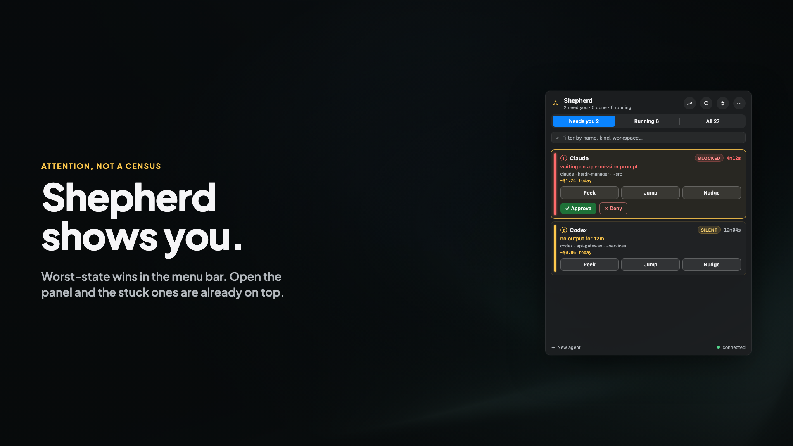
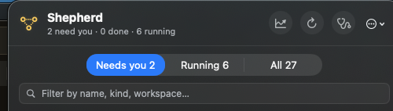

# Shepherd

Shepherd is a macOS menu-bar app that triages a herd of AI coding agents managed by
[herdr](https://github.com/herdrdev/herdr) ([herdr.dev](https://herdr.dev)).
It answers "does anything need me?" at a glance and gets you from blocked to unblocked
in one or two actions.

[](docs/shepherd-launch.mp4)

[Watch the 32s launch film](docs/shepherd-launch.mp4)

<video src="docs/shepherd-launch.mp4" controls playsinline preload="metadata" poster="docs/hero-16x9.png" width="100%">
</video>



- **Live status** — subscription-driven view of every agent pane, with a
  worst-state-wins menu-bar signal.
- **Attention triage** — attention-first panel (not a census): blocked agents, silent
  workers, and finished runs, with how long each has been waiting.
- **Pending actions** — approve/deny prompts surfaced inline, with bounded reply
  choices, interrupt/stop with confirmation, and optional spawning of new sessions.
- **Usage dashboard** — model-aware token/cost tracking with per-model pricing,
  framed honestly as an estimate, not a bill.

Shepherd talks to herdr's local JSON socket API. All herdr knowledge is isolated behind
an adapter boundary; compatibility is capability-based — an unknown protocol disables
writes with a visible reason while reads continue.

## Requirements

- macOS 14+
- Xcode 16+ (Swift 6 toolchain)
- [herdr](https://github.com/herdrdev/herdr) installed and running
  (verified baseline: herdr 0.7.5, wire protocol 17)

## How it finds herdr

The herdr socket is resolved in this order:

1. `HERDR_SOCKET_PATH` environment variable (explicit override)
2. `HERDR_SESSION` environment variable — resolved against herdr's session
   registry (`herdr session list`) first, then
   `<config>/herdr/sessions/<name>/herdr.sock`. If the session can't be
   resolved, resolution falls through to the defaults below.
3. `$XDG_CONFIG_HOME/herdr/herdr.sock`
4. `~/.config/herdr/herdr.sock` (default)

## Quick start

Shepherd has nothing to talk to without herdr, so install and start it first:

```sh
brew install herdr          # or: curl -fsSL https://herdr.dev/install.sh | sh
herdr                       # start it where your work lives
```

Then build and run Shepherd:

```sh
git clone https://github.com/sxp4931/herdr-manager.git
cd herdr-manager
swift build
swift run ShepherdApp
```

A menu-bar icon appears. If herdr is not running, the panel shows where it looked,
links to [herdr.dev](https://herdr.dev) if you don't have herdr yet, and lets you
reconnect with ⌘R.

### Release build

```sh
./build-app.sh
```

Produces a signed `Shepherd.app` bundle (launch with `open Shepherd.app`).
If a Developer ID identity is available the script uses it; otherwise the
bundle is ad-hoc signed. If Gatekeeper blocks an ad-hoc build on another Mac,
right-click → Open once to launch it.
The bundle also includes the MCP server as a helper binary at
`Shepherd.app/Contents/Helpers/herdr-manager-mcp`, giving agent hosts a stable
command path.

Current bundle version is **0.1.1**.

### Disk image

```sh
./build-dmg.sh
```

Builds a drag-to-Applications `Shepherd-<version>.dmg`. Pass `SKIP_APP_BUILD=1`
to reuse an existing `Shepherd.app`.

## Other executables

### herdmgr — CLI status client

```sh
swift run herdmgr              # live table of attention-worthy agents
swift run herdmgr --show-all   # all agents, not just attention-worthy ones
swift run herdmgr --json       # output as JSON
swift run herdmgr --socket <path>  # explicit herdr socket path
```

### herdr-manager-mcp — stdio MCP server

```sh
swift run herdr-manager-mcp
```

A stdio JSON-RPC/MCP bridge so orchestrating agents (Claude Code, Codex, OpenCode, …)
can read the same live state and act on it under the same policy as the UI. Writes are
policy-gated and bounded by design — no free-form shell passthrough.

## Development

```sh
swift test
```

Runs the Swift Testing suite (182 tests) covering adapter decoding, policy decisions,
persistence, redaction, and state classification.

Package layout:

| Target | Description |
| --- | --- |
| `Sources/HerdrManagerCore/` | Shared domain, adapter, diagnosis, policy, persistence, and redaction code |
| `Sources/ShepherdApp/` | SwiftUI menu-bar application |
| `Sources/herdmgr/` | Command-line status client |
| `Sources/herdr-manager-mcp/` | stdio JSON-RPC/MCP server |
| `Tests/HerdrManagerCoreTests/` | Core unit tests |

Contributor conventions live in [AGENTS.md](AGENTS.md). [PLAN.md](PLAN.md) is
the original protocol and architecture research — a design diary, not a user
guide. Shipped code wins where they disagree.

## License

MIT — see [LICENSE](LICENSE).
